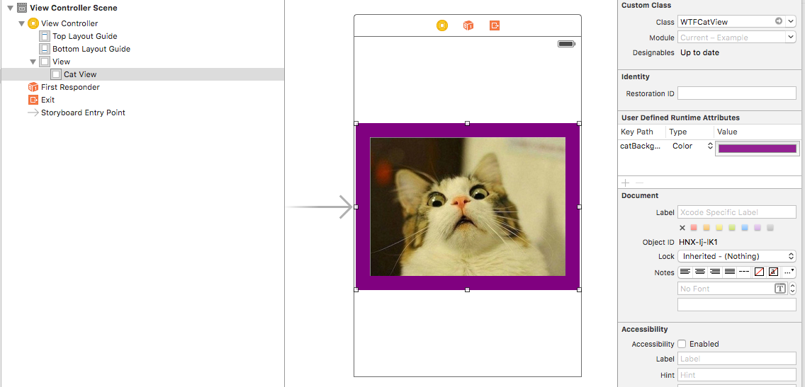

 &nbsp;
[](http://codecov.io/github/MLSDev/LoadableViews?branch=master)
 &nbsp;
 &nbsp;
[](https://github.com/Carthage/Carthage)
[]()

# LoadableViews

Easiest way to load view classes into another XIB or storyboard.



## Setup

* Subclass your view from LoadableView
* Create a xib file, set File's Owner class to your class
* Link outlets as usual

## Usage

* Drop UIView to your XIB or storyboard
* Set it's class to your class name

Your view is automatically loaded to different xib!

## IBInspectable && IBDesignable

IBInspectables automatically render themselves if your view is IBDesignable. Usually Interface Builder is not able to automatically figure out that your view is IBInspectable, so you need to add this attribute to your view subclass:

```swift
  @IBDesignable class WTFCatView: LoadableView
```

## UI classes supported

- [x] UIView
- [x] UITableViewCell
- [x] UICollectionViewCell
- [x] UICollectionReusableView

## Requirements

* iOS 8+
* tvOS 9.0+

## Installation

#### CocoaPods

```ruby
  pod 'LoadableViews', '~> 1.0.0'
```

#### Carthage

```ruby
  carthage 'MLSDev/LoadableViews' "1.0.0"
```

## License

`LoadableView` is released under the MIT license. See LICENSE for details.

## About MLSDev

[][mlsdev]

`LoadableView` is maintained by MLSDev, Inc. We specialize in providing all-in-one solution in mobile and web development. Our team follows Lean principles and works according to agile methodologies to deliver the best results reducing the budget for development and its timeline.

Find out more [here][mlsdev] and don't hesitate to [contact us][contact]!

[mlsdev]: http://mlsdev.com
[contact]: http://mlsdev.com/contact_us
